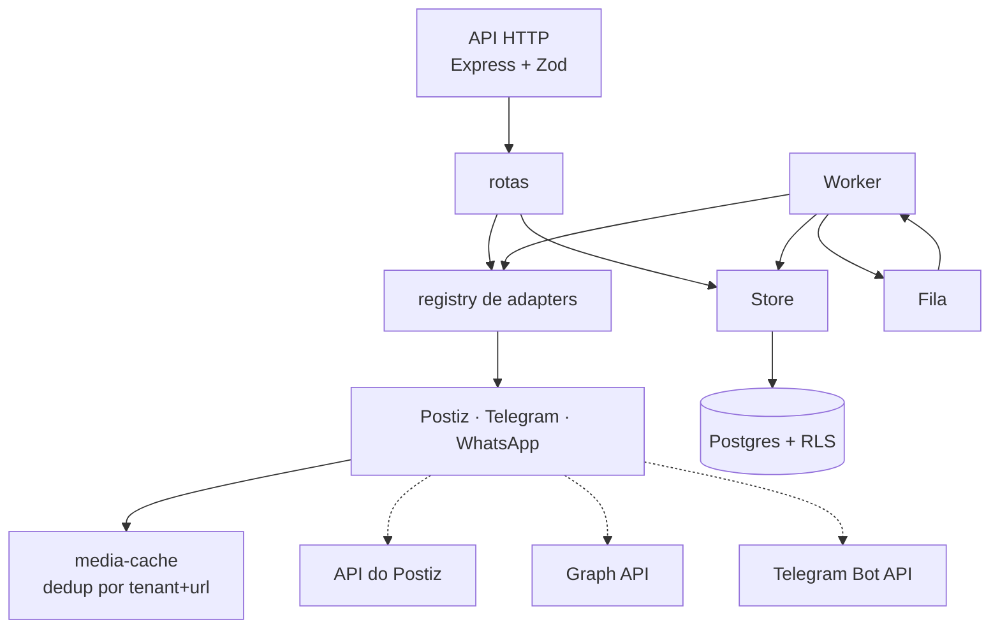
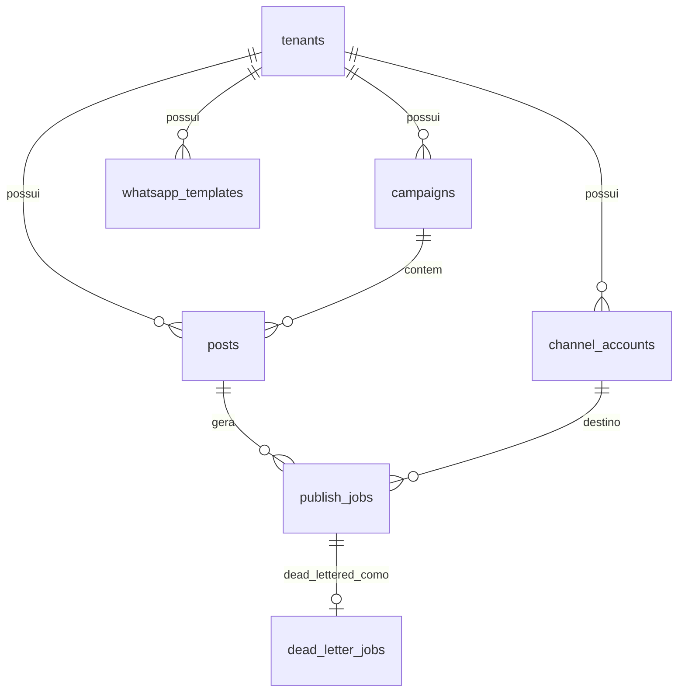

# postmidia — Arquitetura e Etapas do Projeto

> SaaS multicliente para disparar campanhas em múltiplas redes sociais.
> Documento gerado a partir do estado real do código em `src/`. Tudo que está
> marcado como **verificado** foi executado de verdade; o resto está explícito
> como pendência.

---

## 1. Escopo

**Canais alvo:** Instagram, Facebook, LinkedIn, TikTok, YouTube, X, Telegram, WhatsApp.

**Não é um agregador puro.** O produto é um núcleo de campanha próprio que usa
redes de terceiros apenas como *transporte de publicação*.

### O problema que definiu a arquitetura

Agregadores de publicação (Postiz, Ayrshare, etc.) são Thinking→Doing, não
Thinking→Done. Faltam três coisas que um SaaS precisa:

| Lacuna | Consequência se ignorada |
|---|---|
| Agendamento é do agregador | Dois agendadores = publicação duplicada ou perdida |
| Tenant não existe como conceito | Vazamento de credenciais e de templates entre clientes |
| Templates de WhatsApp são externos | Publicação falha por template não aprovado, sem aviso prévio |

---

## 2. Decisões de arquitetura

Formato: decisão → motivo → alternativa descartada.

### D1 — O core é dono do agendamento

Postiz entra **só como adapter de publicação**, com `type: 'now'`. O job, o
`scheduledAt`, o retry e o estado vivem no nosso banco.

- **Descartado:** usar o agendador do Postiz. Dois agendadores competem pelo
  mesmo post; um dos dois perde o evento.
- **Verificado:** job agendado executa no vencimento e persiste
  `attempts`/`lastError` no Postgres.

### D2 — WhatsApp e Telegram nativos

O Postiz **não cobre WhatsApp**. Telegram existe lá, mas foi implementado
nativo para não depender do agregador num canal crítico.

- **Postiz** cobre: `instagram`, `facebook`, `linkedin`, `tiktok`, `youtube`, `x`
- **Nativo** cobre: `whatsapp` (Graph API v21.0), `telegram` (Bot API)
- **Verificado:** 8 redes registradas em `GET /capabilities`.

### D3 — Segredos cifrados em repouso, nunca em log

`ChannelAccount.encryptedSecret` com AES-256-GCM. O adapter recebe um
`ResolvedChannelAccount` já decifrado, então a chave nunca toca a camada de
canais.

- **Verificado:** banco contém `iv.tag.ciphertext`; nenhum endpoint devolve
  `encryptedSecret`.

### D4 — Isolamento entre tenants imposto pelo banco (RLS)

A aplicação conecta com um papel **não superuser**; o dono das tabelas é um
papel separado, só da migration. Cada transação de tenant faz
`set_config('app.tenant_id', $1, true)`.

- **Descartado:** só `WHERE tenant_id = $1` no código. Funciona até alguém
  esquecer a cláusula — e o esquecimento é silencioso.
- **Verificado:** papel da aplicação lê 2 templates, o dono lê 3, no mesmo
  banco e no mesmo instante.

> **Armadilha:** superuser ignora RLS **incondicionalmente**, mesmo com
> `FORCE ROW LEVEL SECURITY`. Um `POSTGRES_USER` superuser torna as policies
> inertes sem nenhum erro. Por isso `src/db/pool.ts` recusa o boot se detectar
> `rolsuper` ou `rolbypassrls`.

### D5 — `PublishSpec` genérico, payload específico por rede

`text` + `media` não cobriam YouTube (que exige `title`) nem TikTok (que exige
oito campos). O spec ganhou `settings: Record<string, unknown>` e cada rede
traduz para o contrato dela.

- **Verificado:** post sem `settings.title` é barrado com
  `youtube_title_required`.

### D6 — Falha de credencial não é retentável

`PublishError.authFailure` (401/403 do Postiz, erro 190 da Meta) marca a conta
como `expired` imediatamente, em vez de gastar cinco tentativas com um token
morto.

### D7 — Sucesso sem id é sucesso, mas sinalizado

O Postiz responde sucesso com `releaseId: "missing"` quando a plataforma não
devolveu o id. Retry duplicaria a publicação. O `PublishResult` carrega
`releaseIdMissing`: marca como sucesso e deixa o job reconciliável — com uma
ressalva que só aparece na reconciliação: o marcador é gravado só quando o id
ainda **pode** aparecer. No modo `UPLOAD` do TikTok ele não aparece nunca, e um
job marcado ali seria uma busca sem fim. Daí `reconcilable`, que o adapter
Postiz define como `releaseIdMissing && !uploadOnlyMode`, e que Telegram e
WhatsApp deixam `false` porque publicam direto e não têm o que reconciliar.

### D8 — O painel operacional não pode usar o JWT de tenant

`GET /ops/metrics` conta jobs de **todos** os clientes. A primeira ideia foi
`requireRole('owner')`, que é o que todo endpoint de tenant usa — e está errada.

`owner` e `admin` são papéis **por tenant**: o dono de uma loja tem `owner` na
própria loja. Uma rota global protegida por `owner` mostraria a fila inteira
para o dono de qualquer loja. Não é um detalhe de implementação, é o formato do
papel.

O RLS não segura essa rota. A leitura dela é de sistema (`app.is_system`), e
`withSystem` existe justamente para atravessar o RLS — foi ele que bridou
`listJobsPendingReconciliation` na reconciliação. Um gate no código não pode
"reaproveitar" a proteção do banco quando ele propio desligou a proteção.

- **Descartado:** `requireRole('owner')`. Vaza a fila inteira.
- **Descartado:** JWT de plataforma separado por instalação, com `aud` e
  expiração. Dá trabalho de emissão e revogação para um segredo que muda na
  prática quando alguém reinstala.
- **Verificado:** token de plataforma estático em `METRICS_TOKEN`, comparação em
  tempo constante, obrigatório no boot de produção e `503` (falha fechada) sem
  ele. O E2E prova que o JWT de tenant **não** abre a rota, e o `verify:metrics`
  semeia dois tenants e prova que a visão por tenant não enxerga o vizinho.

Duas consequências que valem registrar:

- **Sem agregado "todos os tenants lado a lado"** em `byTenant`. Uma lista
  ordenada de volume por cliente é ela mesma um vazamento entre tenants, e o
  operador pode escolher o tenant que quer investigar com `?tenantId=`, que
  volta a ser leitura de tenant comum (`withTenant`, RLS normal).
- **A leitura da fila morta em sistema exigiu policy nova**
  (`system_read_dead_letter_jobs`, `FOR SELECT`). Sem ela a consulta do painel
  não dava erro: o RLS escondia as linhas e o painel mostrava "zero pendências".
  Um painel que mente calmamente é pior do que um painel quebrado, então
  `verify:metrics` semeia uma DLQ e exige que as duas visões a contem.

### D9 — Latência de publicação vem de `published_at`

`updated_at` seria a coluna mais óbvia e estaria errada. A reconciliação patcha
o job horas depois de publicado, e qualquer métrica derivada de `updated_at`
passaria a medir a **lentidão da reconciliação**. `published_at` é escrito uma
vez, no sucesso, e nunca mais muda.

- **Verificado:** `verify:metrics` mede a latência, patcha o job como a
  reconciliação faria, e exige que o p50 não se mova.

`byStatus` também não usa a janela: é o estoque atual da fila, e um job travado
há três dias continua sendo trabalho pendente hoje. O volume por rede é que é
recortado — aquilo é registro de atividade, não de estoque.

### D10 — A cota do Postiz é contada por classe, e conta tentativas

O Postiz impõe 90/h em `POST /posts` e 30/h em `POST /upload-from-url`, e **não**
cobra `GET /posts/:id/missing`. Três decisões seguem daí:

- **Duas classes, não um contador só.** O limite que aperta primeiro é o de
  upload (30 < 90), e um contador único esconderia isso.
- **Conta tentativa, não sucesso.** Um 500 do provedor consome cota do mesmo
  jeito, e é justamente a falha que mais repete.
- **Janela deslizante em `ZSET` no Redis**, não `INCR` com TTL. `INCR`+`EXPIRE`
  daria uma janela que reinicia no primeiro incremento e contaria errado na
  virada de hora.

Sem Redis o contador cai para memória do processo e o campo `tracked` diz `false`
— o painel prefere mostrar "não rastreado" a mostrar um número que morre com o
processo.

---

## 3. Componentes



### Mapa de arquivos

| Camada | Arquivos | Responsabilidade |
|---|---|---|
| Config | `src/config.ts` | Env validado por Zod, falha no boot se inválido |
| Domínio | `src/domain/types.ts`, `networks.ts` | Entidades, limites por rede |
| Contrato | `src/channels/adapter.ts` | `ChannelAdapter`, `PublishSpec`, `PublishError` |
| Canais | `src/channels/*.adapter.ts` | Uma classe por rede |
| Postiz | `src/channels/postiz/*` | Cliente HTTP, settings por rede, cache de mídia |
| WhatsApp | `src/channels/whatsapp/request.ts` | Montagem de template/text e validação |
| Store | `src/store/{types,memory.store,postgres.store}.ts` | Interface + 2 backends |
| Banco | `src/db/{pool,schema.sql,migrate}.ts` | Pool, RLS, guard, migration |
| Fila | `src/queue/*` | Interface + implementação em memória |
| Worker | `src/worker.ts` | Retry, backoff, expiração de credencial |
| HTTP | `src/routes/*`, `src/http/*` | Rotas, `requireTenant`, error handler |

---

## 4. Modelo de dados



| Tabela | Chave de tenant | Observações |
|---|---|---|
| `tenants` | — | Sem RLS; só a API cria |
| `channel_accounts` | `UNIQUE (tenant_id, network, external_account_id)` | `encrypted_secret`; Fase 7: `provider_max_length`, `provider_rules`, `specs_synced_at` |
| `campaigns` | `id` | |
| `posts` | `campaign_id` | `media` e `settings` em `jsonb` |
| `publish_jobs` | `post_id` | `recipient` para fan-out; índice `(status, scheduled_at)`; Fase 9: `release_id_missing` + índice parcial `WHERE release_id_missing` |
| `dead_letter_jobs` | `job_id` | Fase 9. `UNIQUE (job_id)`, `resolution` anulável, `requeue_count`, `ON DELETE CASCADE` |
| `whatsapp_templates` | `UNIQUE (tenant_id, name, language_code)` | Sem `UNIQUE` global, senão tenants colidem |

### Mapeamento de credenciais

| Rede | `externalAccountId` | `secret` |
|---|---|---|
| Postiz (6 redes) | integration ID | API key do Postiz |
| Telegram | chat ID | token do bot |
| WhatsApp | phone-number ID | token da Cloud API |

---

## 5. Contrato do Postiz (verificado na documentação)

Errei esse contrato inteiro na primeira implementação. A tabela é a correção.

| Aspecto | Errado antes | Correto |
|---|---|---|
| Base URL | `/api/public/v1` | cloud `https://api.postiz.com/public/v1`; self-host `https://{dominio}/api/public/v1` |
| Auth | header `APIKEY` | header `Authorization` |
| Destinos | `integrations: [id]` | `posts: [{ integration: { id } }]` |
| Conteúdo | `text` + `media[]` | `value: [{ content, image: [{ id, path }] }]` — **array** |
| Mídia | URL direta | `POST /upload-from-url` antes; o `{ id, path }` do retorno vai no post |
| Settings | `contentFormat: 'Image'` | `settings.__type` + campos obrigatórios por rede |

### Campos obrigatórios por rede

| Rede | Exigências |
|---|---|
| Instagram | `post_type`: `post` \| `story` — **não existe `reel`**; reel é `post` com vídeo único |
| YouTube | `title` (2–100 caracteres) |
| TikTok | `privacy_level`, `duet`, `stitch`, `comment`, `autoAddMusic`, `brand_content_toggle`, `brand_organic_toggle`, `content_posting_method` |

### Rate limits (Postiz)

| Endpoint | Limite | Conta |
|---|---|---|
| `POST /posts` | 90/h por organização (100 no cloud) | `ThrottlerGuard` global do Postiz, chaveado por `org.id` + `_posts` |
| `POST /upload-from-url` | 30/h | throttler do próprio controller |
| `GET /integration-settings/{id}` | 30/h | throttler do próprio controller |
| `GET /posts/{id}/missing` | **sem limite** | reconciliação; não é interceptado pelo throttler global |

O detalhe que importa: o `ThrottlerBehindProxyGuard` só se aplica a
`POST /public/v1/posts`. Consultar `GET /posts/{id}/missing` não gasta a cota de
90/h. A reconciliação não é problema de *cota*, é de *tempo* — o
`getMissingContent` pode renovar token e dormir 10s quando a integração tem
`refreshWait` (timeout do client: 60s). Daí o `RECONCILE_BATCH` pequeno e o
intervalo longo: o custo de reconciliar é latência do worker, não orçamento de API.

**Impacto no produto:** ~2.160 jobs/dia no cloud, e o limite é **por instância,
não por plano**. Não dá para tier por assinatura sem self-host com
`API_LIMIT` maior. Isso decide quando migrar um canal para nativo.

Mitigação já implementada: `media-cache.ts` deduplica upload por
`tenantId + url` e coalesce requisições em voo — sem isso, uma imagem em 6 redes
viraria 6 uploads.

---

## 6. Segurança

| Controle | Estado |
|---|---|
| AES-256-GCM em segredos | ✅ |
| RLS entre tenants | ✅ verificado |
| Guard anti-superuser no boot | ✅ verificado |
| JWT assinado; `alg=none` e issuer errado rejeitados | ✅ verificado |
| Senhas em scrypt, custo constante no login | ✅ verificado |
| Papéis `owner` / `admin` / `member` | ✅ verificado |
| `POST /tenants` público | ✅ removido, agora 404 |
| Header `x-tenant-id` sem assinatura | ✅ recusado no boot em produção |
| Trilha de auditoria (`audit_log`, RLS) | ✅ verificado |
| Rate limit por IP em `/auth` (20/min) | ✅ verificado, in-memory |

O que ainda segura o serviço fechado: rate limit em memória zera no restart e
não protege múltiplas instâncias (Fase 4), e não há verificação de e-mail nem
recuperação de senha — o signup assume usuário vindo por convite.

---

## 7. Etapas do projeto

**Legenda:** ✅ concluído e verificado · 🔶 parcial · ⬜ não iniciado

### Fase 0 — Fundação ✅
Node + TypeScript strict, Express, Zod, Axios. Config validada por Zod com
fail-fast no boot. `npm run typecheck` e `npm run build` limpos.

### Fase 1 — Núcleo de publicação e adapters ✅
Interface `ChannelAdapter`, registry, 8 redes, fila, worker com backoff
exponencial, `EMBEDDED_WORKER` para dev single-process.

> Dois bugs reais encontrados aqui: o registry não era inicializado no processo
> HTTP, e a fila em memória não tinha consumidor — jobs eram aceitos e
> descartados.

### Fase 2 — Persistência e isolamento ✅
Store interface com backends memória e Postgres. Schema com RLS, chaves
compostas por tenant, migration idempotente e reexecutável.

**Aceite:** papel da aplicação lê 2 templates enquanto o dono lê 3; UPDATE
cross-tenant retorna `UPDATE 0`; INSERT com `tenant_id` divergente é rejeitado
pela policy; contexto não definido retorna 0 linhas; dados sobrevivem a
restart do processo.

### Fase 3 — Autenticação ✅
JWT HS256 com `tenantId` no subject. Senhas em scrypt com custo constante no
login. Papéis `owner` / `admin` / `member`. Audit log append-only por tenant.

| Item | Estado |
|---|---|
| `POST /auth/signup` (cria tenant + owner) | ✅ atrás de `ALLOW_SELF_SIGNUP` |
| `POST /auth/login` por `slug` + e-mail + senha | ✅ |
| `GET /auth/me` | ✅ |
| `GET /audit` | ✅ |
| Remoção do `POST /tenants` público | ✅ agora 404 |
| `requireRole` em contas e templates | ✅ |
| Rate limit por IP em `/auth` (20/min) | ✅ Redis (sliding window, com fallback em memória) |
| Header `x-tenant-id` | ✅ só com `ALLOW_TENANT_HEADER`, **recusado no boot em produção** |

**Por que o login usa `slug`:** o login não tem contexto de tenant ainda. Se
buscássemos o usuário por e-mail global, a leitura atravessaria tenants — e o
RLS não ajudaria, porque o contexto ainda não existe. Pedir o slug resolve: o
tenant vem do slug e o `SELECT` em `users` passa pelo RLS normalmente, sem
`SECURITY DEFINER` nem privilégio elevado.

**Aceite verificado:** sem token → 401; `alg=none` → 401; issuer errado → 401;
token de B em recurso de A → 404; `passwordHash` nunca sai em resposta; senha
errada e e-mail inexistente dão a mesma mensagem e o mesmo custo.

#### Endurecimento de produção

Duas correções que não são features, mas que evitam incidentes silenciosos.

**1. Invariantes de produção verificadas no boot.** `assertProductionSafety()`
roda em `src/server.ts` e no `src/worker.ts` e sai com código 1, com mensagem
acionável, quando a config é insegura. Antes disso, um `JWT_SECRET` de exemplo
significava que qualquer um forjava token de admin — e a API subia sem reclamar.

| Situação | Resultado |
|---|---|
| Config válida | passa |
| `JWT_SECRET` de exemplo (`postmidia-dev-jwt-secret`) | bloqueia |
| `JWT_SECRET` com menos de 32 chars | bloqueia |
| `TOKEN_ENCRYPTION_KEY` nula (`000…`) | bloqueia |
| `ALLOW_TENANT_HEADER=true` | bloqueia |
| `REDIS_URL` ausente | bloqueia |
| `DATABASE_URL` ausente | bloqueia |
| `NODE_ENV=development` com tudo vazio | passa (o guard é só de produção) |

`ALLOW_SELF_SIGNUP=true` e `POSTIZ_API_KEY` vazio são **avisos**, não bloqueio:
são decisões de produto ou de configuração que podem ser legítimas.

**2. `audit_log` é append-only no banco, não por convenção.** Antes, a policy
tinha `USING` + `WITH CHECK` sem restringir o comando — ou seja, permitia
`UPDATE` e `DELETE` — e o `GRANT` genérico dava esses privilégios ao papel da
app. O comentário no schema dizia "append-only" enquanto o banco permitia o
oposto.

Agora existem policies separadas `FOR SELECT` e `FOR INSERT`. Sem policy para
`UPDATE`/`DELETE`, o Postgres nega. E o `REVOKE UPDATE, DELETE ON audit_log`
remove o privilégio, como defense in depth: se alguém recriar a policy
permissiva, o privilégio continua ausente.

O FK para `tenants` era `ON DELETE CASCADE`, o que permitiria apagar o histórico
inteiro junto com o tenant. Virou `RESTRICT`.

Verificado como `postmidia_app` (`superuser=false`, `bypassrls=false`):

| Operação | Resultado |
|---|---|
| `INSERT` no próprio tenant | `INSERT 0 1` |
| `SELECT` no próprio tenant | 12 linhas |
| `UPDATE` no próprio tenant | `permission denied for table audit_log` |
| `DELETE` no próprio tenant | `permission denied for table audit_log` |
| `UPDATE` em massa | `permission denied for table audit_log` |
| `INSERT` com tenant de outro | `new row violates row-level security policy` |

**O worker passou a auditar publicação.** Antes só a camada HTTP auditava, e o
que importava para o produto — quem publicou, o que falhou — ficava invisível:

| Evento | `action` |
|---|---|
| Publicação ok | `publish.succeeded` (com `externalPostId`, `permalink`, `releaseIdMissing`) |
| Falha definitiva | `publish.failed` (com `code`, `retryable`, tentativa) |
| Reagendamento | `publish.retry_scheduled` (com tentativa e `delayMs`) |
| Credencial rejeitada | `account.credential_rejected` |

Essas quatro são **best-effort**: se a auditoria falhar, o job não fica preso em
`running` — o erro é logado e o fluxo segue. Auditar não pode custar a
disponibilidade do processamento.

**Pendências que continuam abertas:** `JWT_SECRET` ainda tem default de
desenvolvimento no schema (o guard é que barra em produção), a auditoria não é
transacional com a mutação que descreve, e o papel dono ainda consegue apagar o
log. Log à prova de adulteração de verdade exigiria armazenamento separado
(WORM), não privilégio de banco.

### Fase 4 — Fila distribuída ✅
A fila deixou de ser memória. `scheduled_at` virou índice de atraso no Redis, e
não mais timer dentro do processo.

- [x] `PublishQueue` → BullMQ sobre Redis (`REDIS_URL`), fila `postmidia-publish`
- [x] Lock de job para impedir execução duplicada em múltiplos workers
- [x] `scheduled_at` vira índice de atraso, não timer em memória
- [x] Rate limit movido para o mesmo Redis (janela deslizante, atomicidade por Lua)

**Decisões:**

- **Fila separada da API.** `EMBEDDED_WORKER=false` deixa a API sem worker; o
  worker roda em processo próprio (`npm run worker`). Escalar um não escala o outro.
- **Um `jobId` por tentativa** (`{publishJobId}#{tentativa}`). Sem isso, reenfileirar
  o mesmo job com o `jobId` original seria recusado como duplicata pelo BullMQ.
- **O job da fila é uma foto do estado em `enqueue`.** O worker relê o job no Postgres
  antes de agir, então editar a fila não altera o trabalho já agendado.
- **Retry é do Postgres, não do BullMQ.** O histórico de tentativas écolhido aqui
  (`attempts`, `lastError`); o `backoff` é calculado pelo core. O BullMQ recebe o
  job com `attempts: 1` e sempre em modo manual — do contrário teríamos dois
  históricos concorrentes e retries duplicados.
- **Degradação explícita.** Sem Redis, a API continua no ar e o rate limit cai para
  memória. A fila, não: sem Redis ela não agenda nada, e fingir que agendou seria
  pior do que falhar.

**Aceite verificado** (`scripts/verify-e2e.sh`, API e worker em processos distintos,
29 checks, 0 falhas (19 originais da Fase 4 + 10 da Fase 7)):

| Verificação | Resultado |
|---|---|
| `GET /health` com fila em `bullmq/redis` | 200 |
| API sem worker embarcado | ✅ |
| 2 jobs de fan-out persistidos como `delayed` no Redis, sem worker ativo | `ZCARD = 2` |
| Worker novo executa job que ele nunca viu | ✅ |
| Worker novo retoma o que ficou na fila quando o anterior morre | `1 queued → 0` |
| Rate limit de `/auth` visto por ambos os processos | 6× 429 em 25 tentativas |
| Token ausente / inválido | 401 / 401 |
| Erro de auth da Graph marca a conta `expired` e barra o próximo post | 190 → 422 |

O `scripts/verify-queue.ts` isola a garantia central: um job agendado continua no
Redis depois do processo que o enfileirou morrer, e é executado por um worker
recém-iniciado. É a propriedade que a fila em memória não tinha.

**Armadilha do Windows resolvida (porta do Redis):** a porta `56379` falhava com
`ECONNREFUSED` do host, mesmo com o container saudável e respondendo `PONG` por
dentro, e mesmo publicando em `0.0.0.0`. A causa era o Windows, não o projeto:

```
> netsh interface ipv4 show excludedportrange protocol=tcp
     56333      56432      <- 56379 cai aqui
```

O SO reserva essa faixa para conexões de **saída**, e o proxy de portas do Docker
não consegue associá-la no host. Dentro da VM tudo funciona, de fora não. Duas
coisas mascararam o diagnóstico: a porta do Postgres (`55432`) funciona porque
está fora das exclusões, e a faixa dinâmica padrão do Windows (`49152-65535`)
torna qualquer porta "acima de 49k" suspeita.

**Como não perder tempo de novo:** porta de serviço deve ficar **abaixo de
49152**. Antes de escolher uma, cheque:

```bash
netsh interface ipv4 show excludedportrange protocol=tcp
```

Hoje o Redis local usa `5638`. Isso também destravou a verificação: antes ela rodava
de dentro da rede Docker porque o host não alcançava a porta; agora roda direto no
host.

### Fase 5 — Postiz ponta a porta ✅ (até onde dá sem credenciais reais)
O payload deixou de ser escrito contra a documentação e passou a ser conferido
contra a **API em execução**. O que ainda não dá para provar é a publicação de
verdade, que exige tokens de cada rede.

**Entrada única:** `docker compose up -d` (idempotente; `docker compose down` derruba
preservando os volumes).

#### Um Postgres e um Redis, não um por serviço

O primeiro desenho subia 6 containers, cada um com seu Postgres e seu Redis. Isso
estava errado para desenvolvimento: o postmidia já tem Postgres e Redis locais, e
subir instâncias concorrentes só consome RAM (o stack chegou a 5 GiB e a fazer o
Docker devolver `timed out dialing Hyper-V socket`). Um banco de dados é um
*schema*, não um container.

O `docker-compose.yml` atual tem 5 serviços:

| Serviço | Container próprio? | Por quê |
| --- | --- | --- |
| `postgres` | sim, **1 só** | `postmidia`, `postiz` e `temporal` viram **databases separados** dentro do mesmo servidor. Databases separados isolam os schemas (cada um roda suas migrations) sem custar um container. |
| `redis` | sim, **1 só** | Isolado por **db index**: `db0` postmidia (fila BullMQ), `db1` postiz, `db2` temporal. Nenhum serviço roda `FLUSHALL`, então conviver é seguro. |
| `temporal` | sim | É microsserviço de verdade (workflow engine). Mas usa o Postgres e o Redis compartilhados. |
| `elasticsearch` | sim | Engine de busca. Não cabe em Postgres, e a visibilidade SQL do Temporal tem limite **compilado** de 3 search attributes `Text`, que o Postiz estoura. |
| `postiz` | sim | A aplicação em si. |

O app postmidia **não** tem serviço no compose: ele roda no host com
`npm run dev` e só usa `localhost:55432` / `localhost:5638`, que são as portas
publicadas dos containers compartilhados.

`scripts/postgres/init-databases.sh` cria os databases `postiz` e `temporal` no
primeiro boot. A imagem oficial do Postgres só cria o `POSTGRES_DB`, então o resto
precisa vir de lá.

> Em produção cada serviço ganha a sua própria instância e o compartilhamento deixa
> de valer. Aqui o objetivo é só rodar local.

- [x] Stack sobe: Postiz + Postgres + Redis + Temporal + Elasticsearch
- [x] Um Postgres e um Redis compartilhados entre postmidia, postiz e temporal
- [x] Conta criada e API key gerada, preservadas após `down`/`up`
- [x] Rotas do client conferidas contra as rotas reais do servidor
- [x] Contrato de payload de `POST /posts` aceito pelo DTO
- [x] `upload-from-url` exercitado de verdade
- [ ] Publicação real nas 6 redes — bloqueado por credenciais

#### Nomes de ambiente do Postiz (armadilha)

A imagem do Postiz não lê `REDIS_HOST`/`REDIS_PORT`/`REDIS_DB` — ela lê uma
`REDIS_URL` única. E **não** se deve setar `PORT`: a imagem serve frontend e
backend juntos, o Nginx escuta em `5000` e o Nest em `3000`. Setar `PORT=5000`
faz o Nest bindar em `5000` e o Nginx passa a receber `connection refused` em
`3000`, com o container inteiro parecendo "ligado" mas a API em `502`.

O healthcheck também não pode usar `wget`, `curl` ou `nc`: **a imagem não tem
nenhum dos três**. Ele usa o `node` que já roda o Nest.

- [x] `DATABASE_URL` em `postgresql://`, `REDIS_URL` com db index, sem `PORT`
- [x] Healthcheck do Postiz usando `node` (a imagem não tem wget/curl/nc)

#### O que o teste contra a API mudou no código

O `/upload-from-url` do Postiz valida a extensão **antes de baixar** o arquivo e
responde `400 File must have a valid extension: .png, .jpg, .jpeg, .gif, .webp,
.mp4`. Passávamos a URL direto, então uma URL assinada de CDN sem extensão no
final do path virava um 400 opaco, e ainda entrava no cache de mídia como se
fosse erro transiente. Agora `postizUploadFromUrl` valida a extensão e falha com
`postiz_media_extension_unsupported`, sem gastar round-trip. A checagem
anterior em `validateAgainstNetworkSpec` só disparava **se** houvesse extensão
(`if (extension && ...)`), o que é o mesmo furo com outra roupa.

#### O que o stack exige (e o compose oficial não deixa claro)

- **Elasticsearch não é opcional.** A visibilidade do Temporal em Postgres tem
  um teto de **3 search attributes do tipo `Text`**, e o Postiz registra mais que
  isso no boot. O backend morre em `TemporalRegister.onModuleInit` com
  `Unable to create search attributes: cannot have more than 3 search attribute
  of type Text`. Esse teto é constante compilada no Temporal, não dynamic config,
  então não dá para subir o limite.
- **O heap do Elasticsearch é o mesmo do compose oficial.** Fixamos
  `ES_JAVA_OPTS=-Xms256m -Xmx256m`, que já é o que o compose oficial do Postiz
  usa — ou seja, isso **não** é uma economia nossa. O que economiza RAM de verdade
  foi compartilhar o Postgres e o Redis com o app (ver "Um Postgres e um Redis, não
  um por serviço"), que tirou dois containers Postgres e um Redis da equação.
- **O dynamic config precisa ser montado.** A imagem traz um `docker.yaml` de
  0 bytes; sem o volume em `/etc/temporal/config/dynamicconfig`, o Temporal
  aborta. O arquivo está versionado em
  `scripts/temporal-dynamicconfig/development-sql.yaml`.
- **Porta aberta ≠ pronto.** O Nginx abre o listener e devolve 502 enquanto o
  Nest sobe, e o Nest morre depois com `P1001` se o Postgres estiver
  inacessível. O script só considera pronto quando a API pública devolve
  401/403, o que prova backend de pé *e* guard de API key ativo.
- **A chave vai no header `Authorization` crua.** O guard compara em texto puro
  (`findFirst({ where: { apiKey } })`); mandar `Bearer <chave>` devolve
  `401 Invalid API key`. Nosso client já manda cru, e agora está verificado.
- **`POST /auth/register` exige `provider` e `company`**, e `provider` é
  case-sensitive: `Provider.LOCAL`, não `local`.

#### Riscos que o teste expôs

- A API key da organização fica em **texto puro** na tabela `Organization`.
  Um dump do banco expira todas as chaves; o `fixedEncryption` aparece em
  outros caminhos do repositório, mas não neste.
- O stack inteiro consome **~5 GiB** (Postiz sozinho passa de 3,9 GiB) contra
  7,17 GiB de limite, e o backend do Docker passou a dar
  `timed out dialing Hyper-V socket` nessa pressão. Em máquina menor este stack
  não sobe junto com o resto.

**Aceite:** aceitação de payload comprovada contra a API real; publicação real
ainda pendente de credenciais por rede.

### Fase 6 — WhatsApp real ⬜
- [ ] Sincronizar templates com a Graph API (hoje o status é manual)
- [ ] Tratar a janela de 24h da Meta
- [ ] Validar contra uma WABA de teste

**Aceite:** template `PENDING` da Meta bloqueia a criação do post com mensagem
que aponta a sincronização.

### Como rodar a verificação

`scripts/verify-e2e.sh` precisa de **Git Bash**, não de WSL: o WSL não alcança o
loopback do Windows, e a API sobe em `127.0.0.1:8601`. Rodar direto de uma
ferramenta ou CI quebra por três motivos que não são bugs do projeto:

1. O script deixa API e worker em background. Se quem chamou espera o pipe de
   `stdout`, ele só fecha no fim e o runner mata a árvore no meio da execução.
2. O runner não espera o Git Bash encerrar, então o log em stdout se perde
   mesmo com o teste concluído.
3. Corpo de requisição grande estoura o limite de linha de comando do Windows
   (~32 KB), e `/tmp` do Git Bash é path MSYS que o `node` nativo não
   entende — ele traduz para `C:\tmp`, que não existe.

Por isso o entrypoint é **`scripts/run-e2e.ps1`**, que encapsula os três
pontos: `Start-Process` desanexa os pipes, o log vai para arquivo, a execução é
esperada por polling do `RESULTADO:` e a limpeza dos órfãos (porta 8601 e
processos `server.ts`/`worker.ts`) acontece no fim. `verify-e2e.sh` continua
sendo a fonte da verdade dos testes; o runner só resolve as condições de
ambiente.

```powershell
.\scripts\run-e2e.ps1              # suite completa
.\scripts\run-e2e.ps1 -TimeoutSeconds 600
```

Erros que valem reconhecer no log, porque não indicam teste quebrado:

| Sintoma | Causa real |
|---|---|
| `Unknown: ChildProcess.kill` ao terminar | runner matou a árvore; leia o log |
| `ENOENT ... C:\tmp\*.json` | `node` nativo com path MSYS; use `cygpath -w` |
| `curl: Argument list too long` | body inline acima de ~32 KB; use `--data-binary @arquivo` |

### Fase 7 - Limites autoritativos (implementada)

`NETWORK_SPECS` continua hardcoded e parcialmente inferido, mas deixou de ser a
fonte da verdade. O `integration-settings` do Postiz passou a alimentar a
validacao.

**O que foi implementado**

- `channel_accounts` ganhou `provider_max_length`, `provider_rules` e
  `specs_synced_at`. Colunas, e nao tabela nova: os grants do papel da aplicacao
  sao a nivel de tabela e a policy de RLS ja cobre a linha, entao nao ha policy
  nova para manter.
- O onboarding da conta chama o sync logo apos o insert, e
  `POST /accounts/:id/sync-specs` re-sincroniza sob demanda.
- `validateAgainstNetworkSpec` usa `providerMaxLength` quando existe e cai no
  `NETWORK_SPECS` quando nao. Usa o menor dos dois nunca: se a rede encurtar o
  limite, a constante local antiga nao pode continuar autorizando o post.
- A mensagem de `text_too_long` diz de onde veio o limite e cita o valor do
  `NETWORK_SPECS` quando ele diverge, para a divergencia ficar visivel em vez de
  silenciosamente aceita.

**Decisoes que valem registro**

- `rules` do Postiz e texto descritivo das restricoes, nao schema. Fica guardado
  para consulta e auditoria, mas **nao entra na validacao**: parsear prosa
  quebraria em qualquer reformulacao do provedor. `maxLength` e o unico campo
  machine-readable e por isso virou a fonte da verdade. `settings` e o schema dos
  campos de configuracao, que nao tem papel no limite de conteudo.
- O sync **nunca lanca**. Se o Postiz estiver fora do ar, a conta e criada
  mesmo assim, com o cache anterior preservado e o header `X-Provider-Specs:
  stale` no 201. Falhar o onboarding por dependencia opcional seria pior do que
  publicar com limite antigo.
- `providerMaxLength` ausente vira `null` e nunca `0`: `Number(null)` seria 0 e
  reprovaria todo post com texto nao vazio. Esse caso esta coberto por teste.
- Telegram e WhatsApp sao nativas, entao nao ha endpoint de specs para elas.
  `GET /accounts/:id/settings` antes chamava o Postiz e tomaria 404 sempre; agora
  responde `native: true` com o `fallbackMaxLength` e o cache, e `sync-specs`
  responde 422 em vez de gastar chamada.

**Aceite verificado** (`scripts/verify-provider-specs.ts`, 10 checks; e
`scripts/verify-e2e.sh`, secao 9, 10 checks; suite completa em 29 ok, 0 falhas).
O E2E nao consegue cobrir a precedencia do limite do provedor, porque isso
depende de um `maxLength` que so o Postiz real popula e nao ha endpoint para
simular por API; essa parte fica no teste unitario, com fixtures.

### Fase 8 — Mídia e storage ⬜
Hoje as URLs são passadas ao Postiz, que baixa do lado dele. O upload-from-url
é limitado a 30/h e é o caminho mais frágil do desenho.

- [ ] Storage próprio (S3/R2) com URLs assinadas de TTL compatível com o
      limite de 24h do WhatsApp
- [ ] Validação de tamanho, dimensões e duração no upload
- [ ] Remover `bytes` opcional do `MediaRef` — hoje a validação só roda se o
      cliente mandar

### Fase 9 — Observabilidade e operação ◐
- [x] DLQ para jobs que estouraram as tentativas
- [x] Reconciliação de `releaseIdMissing`
- [ ] Métricas: jobs por tenant, taxa de falha por rede, latência de publicação
- [ ] Alerta de quota do Postiz (90/h é pouco)

#### DLQ (implementada)

`dead_letter_jobs` é a fila morta, e o estado autoritativo é o Postgres — não o
Redis. O BullMQ é transporte; se ele perdesse a entrada, a triagem continuaria
existindo.

**Só entra o que ainda pode dar certo.** Um job que esgota as tentativas com
erro retentável vai para a DLQ, porque o operador pode tentar de novo. Erro não
retentável (conteúdo inválido, conta removida) é terminal por definição e vira
`failed` sem entrada: nenhuma reexecução passaria, e a triagem só ganharia
trabalho doomed.

| Decisão | Por quê |
| --- | --- |
| Coluna `resolution` anulável, sem `'pending'` | Aberta é `NULL`. Um texto `'pending'` seria um terceiro estado para o mesmo significado de "ninguém agiu" |
| `UNIQUE (job_id)` + `ON CONFLICT` | Um job que vai e volta da fila morta não vira N linhas: o operador vê uma entrada, com a tentativa mais recente |
| Reabrir limpa `resolved_at` | Requeue zera `attempts`; o job que falhar de novo dead-lettera e precisa reaparecer como aberta |
| `requeue_count` | Torna visível o requeue em laço. Sem ele, o operador só vê "o mesmo erro de novo" |
| Sem `DELETE` na tabela | Fila morta é registro. Descartar é `resolution = 'discarded'`, não apagar |
| `ON DELETE CASCADE` do job | Apagar o post leva a entrada junto; entry órfã não tem quem a treataria |

**O collide de id do requeue.** O id de entrada do BullMQ é `${job.id}#${attempts}`,
porque só `job.id` faria o reagendamento do worker ser um no-op silencioso. Mas o
requeue zera `attempts` para dar orçamento novo, e `#0` é exatamente o id do
dispatch original — que ainda existe em `completed` (`removeOnComplete: 1000`).
O `add` seria ignorado, o requeue retornaria 200 e o job nunca voltaria a rodar.

Por isso `enqueue` aceita um `dispatchKey` opcional, e o requeue passa
`dlq-<entrada>-<n>`. O bug seria silencioso: a API responderia sucesso e nada
publicaria.

**Regras de corrida na rota.** `POST /dead-letters/:id/resolve` recusa, com 409:

- entrada já tratada — um segundo clique republicaria o post;
- job já `succeeded` — o operador viu a triagem antes do job concluir.

Ambas são janelas reais entre a leitura da triagem e o clique. A checagem de
`failed`/`succeeded` acontece **antes** de `patchJob` e `enqueue`, para um
`409` nunca deixar o job meio requeueado.

**Permissões.** `GET /dead-letters` exige `requireTenant`; o `resolve` exige
`owner`/`admin`, o mesmo nível das demais mutações operacionais (contas,
WhatsApp). Requeue dispara publicação real em massa, o que é mais forte que
criar um post — e criar post é liberado a qualquer membro do tenant.

#### Reconciliação de `releaseIdMissing` (implementada)

O Postiz responde **sucesso** com `releaseId: 'missing'` quando a rede ainda não
devolveu o id. Retry não serviria — republicaria o post, e o usuário veria o
conteúdo duplicado. O caminho é perguntar o id depois, e o endpoint público
`GET /posts/{id}/missing` existe para isso.

Enquanto o id não chega, `external_post_id` guarda o id **interno do Postiz**, e
não o id da rede. É por ele que a reconciliação encontra o post. A troca desse
campo pelo id verdadeiro é o ponto do exercício.

**Dois casos que não podem ser tratados igual.** O adapter Postiz marca
`reconcilable` só quando `releaseIdMissing && !uploadOnlyMode`. No modo `UPLOAD`
do TikTok o id não aparece nunca, então deixar o marcador aceso faria o
reconciliador consultar o Postiz indefinidamente atrás de algo que não existe.
O caso transitório marca; o permanente, não.

| Decisão | Por quê |
| --- | --- |
| Marcador booleano, não derivar de `lastError` | `lastError` era um texto livre. Um job reconciliado precisa de um estado que a varredura possa filtrar no banco |
| Índice parcial `WHERE release_id_missing` | A varredura é system-wide e roda sempre; sem o índice, ela paginaria a tabela inteira de `publish_jobs` |
| Gravação só pelo `patchJob` de sucesso do worker | `insertJob` não aceita o marcador. Quem publica é o worker, e ele sabe se o id veio ou não |
| Falha do Postiz não altera o job | O post **foi publicado**. Um 500 do Postiz não pode transformar sucesso em falha |
| Varredura sequencial, lote pequeno | `getMissingContent` pode bloquear 10s. Concorrência alta viraria muitas requisições lentas ao mesmo Postiz |
| Passadas não se sobrepõem | Sem a trava, um Postiz lento empilharia passadas, cada uma com seu lote |
| Passada imediata no boot | Reinício é quando o backlog acumula. Esperar um intervalo inteiro atrasaria justamente o caso que importa |
| Idempotente por construção | Reconciliar duas vezes não faz mal: o job já marcado não volta para a lista |

**`reconciled` é decisão do adapter, não do worker.** Cada adapter diz se o id
pode aparecer depois. Telegram e WhatsApp devolvem `false`: publicam direto na
API deles, não passam pelo Postiz, e não têm o que reconciliar.

**Leitura de sistema é uma permissão própria.** A varredura precisa enxergar o
backlog de todos os tenants, e ela não pertence a nenhum. Isso é uma policy
separada e restrita:

```sql
CREATE POLICY system_read_publish_jobs ON publish_jobs
  FOR SELECT USING (COALESCE(NULLIF(current_setting('app.is_system', true), '')::boolean, false));
```

`FOR SELECT` é o ponto. A policy de tenant continua valendo para escrita: o papel
da aplicação não tem `BYPASSRLS` e nenhuma policy deste esquema autoriza
`withSystem` a **gravar** em nome de um tenant. Ler em todos os tenants e escrever
em todos os tenants são permissões distintas, e a segunda nem existe — todo patch
de job passa por `withTenant(job.tenantId)`. O `verify:reconcile` prova as duas
metades, inclusive que um `UPDATE` cross-tenant via `withSystem` afeta 0 linhas.

**Escopo do `withSystem` antigo.** Antes desta fase, todo `withSystem` só
tocava a tabela `tenants`, que não tem RLS — a função nunca teve poder de
atravessar uma tabela protegida. A primeira chamada a fazer isso foi esta, e o
RLS devolveu **zero linhas em silêncio**, sem erro. Vale saber que "nenhuma
linha" é o modo de falha do RLS, e ele se parece com "não havia nada pendente".

#### Rotas de reconciliação

| Rota | Papel | Respostas |
| --- | --- | --- |
| `POST /jobs/:id/reconcile` | `owner`/`admin` | `200` reconciliado · `202` ainda sem id · `404` job inexistente · `409` não `succeeded` ou já reconciliado · `502` falha do Postiz |

`202` é resultado legítimo, não erro: o Postiz ainda não tem o id porque o
provedor não processou. `502` só aparece quando a consulta ao Postiz falha — e o
job segue `succeeded` e marcado, para a próxima passada.

A rota exige `owner`/`admin` porque lê o segredo cifrado da conta e chama o Postiz
em nome dela — o mesmo nível do resolve da DLQ, não uma leitura comum de job.

#### Como rodar a verificação

```bash
npm run verify:dead-letter   # 17 checks, exige DATABASE_URL
npm run verify:reconcile     # 14 checks, exige DATABASE_URL
npm run verify:metrics       # 15 checks, exige DATABASE_URL
```

`verify:metrics` roda nos dois backends também, e é a bateria que mais importa
quando o painel é global: semeia dois tenants e exige que a visão de sistema veja
os dois, que a visão por tenant veja **só** o seu, e que os percentis em memória
batam com o `percentile_cont` do Postgres. Divergir ali faria o mesmo número
mudar conforme o backend — que é o modo clássico de métrica em que ninguém mais
confia.

Três armadilhas dessa bateria:

- **A janela é sobre `created_at`, e `insertJob` carimba `now()`.** Um job semeado
  com `scheduled_at` antigo está, para efeito de métrica, recém-criado. Envelhecer
  o job de verdade é o que faz o recorte ser testável; o helper faz isso por SQL
  dentro do mesmo `withTenant`, sem escalar privilégio.
- **A latência de referência vem do dado, não da aritmética.** O seed recebe as
  latências em segundos e as aplica sobre `scheduled_at`. A primeira versão
  derivava `publishedAt` de um "agendado há X minutos" e produzia 480/600s em vez
  de 120/240s — o check falhou com um p50 de 540s que parecia bug do Postgres e
  era bug do teste.
- **`METRICS_TOKEN` precisa existir antes do `config` ser importado**, e o
  middleware lê `env.METRICS_TOKEN` a cada requisição, o que permite religar e
  desligar o segredo em tempo de execução para provar a falha fechada sem subir
  outro processo.

Roda a mesma bateria nos dois backends. No Postgres ela prova o que só lá
existe: RLS escondendo a fila morta dos demais tenants, `ON CONFLICT` realmente
atualizando em vez de duplicar, e a `ON DELETE CASCADE` presente no catálogo.
A cascata é conferida no catálogo, e não apagando dados: o papel da aplicação
não tem `DELETE` de propósito, e o teste não deve escalar privilégio.

O `verify:reconcile` sobe um **Postiz fake** numa porta livre e aponta
`POSTIZ_API_BASE_URL` para ele. Sem isso a bateria só testaria o store, e a parte
que importa — o que o Postiz devolve e o que o worker faz com isso — ficaria sem
prova. É o mesmo caminho de rede do Postiz de verdade; só o destino responde o que
o teste quiser. Todos os imports que leem o `env` são dinâmicos, feitos depois do
ajuste, porque import estático é hoisted e congelaria o `config` com o Postiz de
verdade.

O E2E (`scripts/run-e2e.ps1`, 72 checks) cobre a camada HTTP: 401 sem token,
404 em id inexistente, 400 em `action` inválida, os 409 de corrida, o requeue
zerando `attempts`, o discard sem tocar no job, e os três filtros. O estado de
"esgotou as tentativas" é semeado por `scripts/seed-dead-letter.ts`, porque
esperar o backoff real do worker não cabe no tempo do teste.

O painel entra no E2E em quatro checks que não são sobre o 200: sem token, com
token errado, e **com o JWT de tenant no lugar do token de plataforma**. O
terceiro é o que importa — é o cenário real de um dono de loja tentando olhar a
fila dos outros.

Duas armadilhas desse harness, ambas custaram tempo:

- O helper escreve o id da entrada num **arquivo**, nunca no stdout. `store` e
  `pool` escrevem banners de inicialização em `console.log`, e ler o id de
  `$(...)` devolvia três linhas e montava uma URL quebrada em silêncio.
- Cada post de teste usa uma **conta nova**. O requeue reactiva o job com delay
  0, um worker remanescente consome na hora, a publicação falha e a conta é
  marcada `expired` — o post seguinte levaria 422 e o teste passaria a medir
  outra coisa.

**O que o E2E de reconciliação não cobre, e por quê.** O `200` e o `202`
precisam de um post **real** no Postiz com `releaseId: 'missing'`, o que depende
de uma integração social válida. O que o E2E cobre é o resto da rota: 401, 404,
os dois 409, e o `502` quando o id interno semeado não existe no Postiz — que é
o resultado que importa, porque um `200` ali significaria inventar o id de um post
que nunca foi publicado. Os três desfechos do reconciliador (`reconciled`,
`pending`, `error`) estão cobertos no `verify:reconcile`, contra o Postiz fake.
O estado semeado vem de `scripts/seed-reconcile.ts`.

### Fase 10 — Produto ⬜
- [ ] Onboarding de conexão por rede (Meta App Review, LinkedIn, TikTok)
- [ ] Planos compatíveis com os rate limits reais
- [ ] Billing e cobrança por volume

---

## 8. Comandos

```bash
npm run dev         # API + worker embarcado
npm run worker      # worker isolado (com EMBEDDED_WORKER=false na API)
npm run typecheck
npm run build
npm run migrate     # exige DATABASE_MIGRATION_URL

# Verificação da Fase 4 (precisa de Postgres e Redis alcançáveis)
npm run verify:queue

# Verificação da Fase 7 (specs do provedor; sem Docker)
npm run verify:provider-specs

# Verificação da Fase 9 (fila morta; exige DATABASE_URL)
npm run verify:dead-letter

# Verificação da Fase 9 (reconciliação; exige DATABASE_URL, sobe Postiz fake)
npm run verify:reconcile

# Suíte HTTP completa. No Windows, use o runner: ele resolve os paths do
# Git Bash e encerra processo órfão.
powershell -ExecutionPolicy Bypass -File scripts/run-e2e.ps1
sh scripts/verify-e2e.sh

docker run -d --name postmidia-postgres \
  -e POSTGRES_USER=postmidia -e POSTGRES_PASSWORD=postmidia \
  -e POSTGRES_DB=postmidia -p 55432:5432 postgres:16-alpine
docker run -d --name postmidia-redis -p 6379:6379 redis:7-alpine
```

### Variáveis que não podem ser trocadas

| Variável | Papel |
|---|---|
| `DATABASE_URL` | Aplicação. Precisa ser papel **não superuser** |
| `DATABASE_MIGRATION_URL` | Só a migration. Papel dono das tabelas |
| `DATABASE_APP_PASSWORD` | Senha do papel da aplicação |
| `TOKEN_ENCRYPTION_KEY` | 64 hex. **Trocar invalida todos os segredos** |
| `METRICS_TOKEN` | ≥32 chars. Token de plataforma do painel; obrigatório em produção |

---

## 9. Riscos abertos

| Risco | Impacto | Mitigação atual |
|---|---|---|
| Rate limit do Postiz é por instância | ~2.160 jobs/dia, sem tier por plano | Mídia deduplicada; nativo sob demanda |
| Publicação real nunca executada (sem credenciais) | Payload aceito ≠ post publicado | Fase 5 validou DTO, auth e upload; falta uma integração real por rede |
| Stack do Postiz consome ~5 GiB com stores dedicados | Colide com o resto do Docker; Hyper-V socket dá timeout | **Resolvido:** 1 Postgres e 1 Redis compartilhados com o app; heap do ES fixado em 256 MB |
| API key do Postiz guardada em texto puro | Dump do banco expira todas as chaves | Reportado ao upstream; não corrigido |
| `upload-from-url` exige extensão no path | URL assinada de CDN é rejeitada | Guarda local `postiz_media_extension_unsupported` |
| Fila em memória | Restart perde agendamento | ✅ Resolvido na Fase 4 (BullMQ/Redis) |
| `docker-compose.yml` desatualizado | Subia stack quebrada e colidia em 6379 | ✅ Reescrito na Fase 5 com 1 Postgres + 1 Redis compartilhados; `docker compose` é a entrada única |
| Rate limit em memória | Reinício zera a janela; múltiplas instâncias não se protegem | ✅ Resolvido na Fase 4 (Redis, com fallback em memória) |
| Sem Redis, a fila não agenda nada | Indisponibilidade total de publicação | Degradação explícita e visível no `/health`; alerta operacional pendente (Fase 9) |
| Limites de rede hardcoded | Validação pode divergir do provedor | Fase 7 |
| WhatsApp sem storage próprio | 30/h de upload e URLs públicas | Fase 8 |
| `audit_log` não é transacional com a mutação | Auditoria perdida se a transação da escrita falhar depois | Aceito; exige refatorar o store para(unit of work) |
| Papel dono consegue apagar o log | Quem tem `DATABASE_MIGRATION_URL` reinsere a si mesmo | Aceito; log à prova de adulteração exigiria WORM |
| `JWT_SECRET` tem default no schema | Erro de deploy só é pego pelo guard, não pelo parser | Guard no boot de `server` e `worker` |
